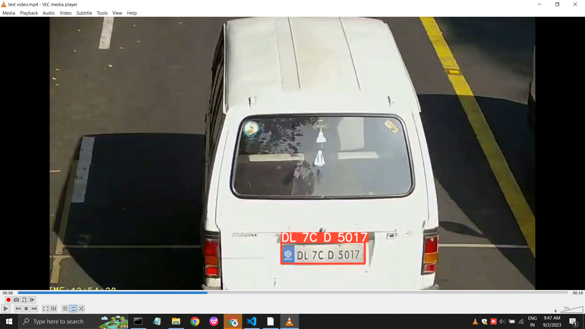

# Number Plate Detection and Object Counting

This project performs number plate detection using computer vision and tracks custom moving objects for counting. It uses YOLO for detection and tracks results using OpenCV.

## Features
- Number Plate Detection with bounding box visualization
- Object Detection and Counting
- Tracking of Custom Objects
- Logging using Pandas in `.log` files
- Real-time video processing

## Installation
```bash
git clone https://github.com/yourusername/number-plate-object-counting.git
cd number-plate-object-counting
pip install -r requirements.txt
```

## Usage

### Number Plate Detection
```bash
python object_tracking.py --input video.mp4 --output output.avi
```

### Object Counting
```bash
python object_counting.py --input video.mp4 --output output.avi
```

### Test
```bash
python test.py
```

## Output
### Number Plate Detection


### Object Counting
Sample Output:  
- Custom Object Counting (Video): [Download Here](Custom_object_Couting_Sample_Output.avi)  
- Moving Object Counting (Video): [Download Here](Moving_Object_Couting_Sample_Output.avi)  

## Contributing
Contributions are welcome! Feel free to fork the repo and submit a pull request.

## License
This project is licensed under the MIT License.
